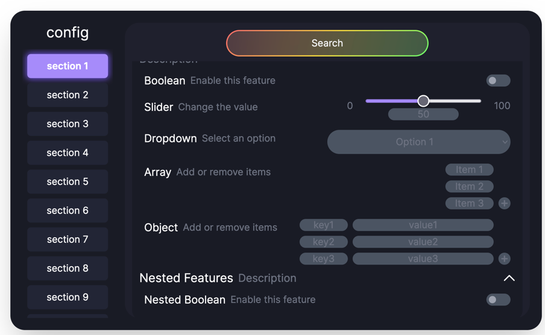

JSON ClickGUI
---

### ⚠️ Warning: This project is still in development and is not yet ready for use!

A ClickGUI component for React, which uses a schema to generate a more user-friendly interface for users when editing
JSON objects.

---

## Setting up a development environment locally

1. Clone the repository
2. Run `npm install` to install the dependencies
3. Run `npm start` to start the development server
4. Open `http://localhost:3000` in your browser